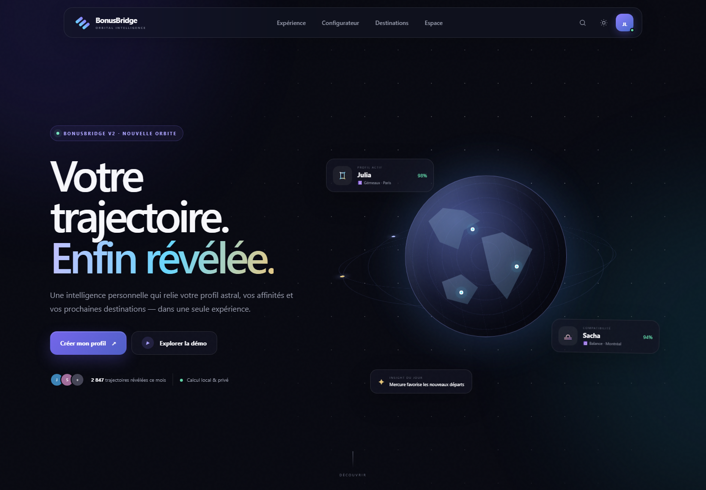
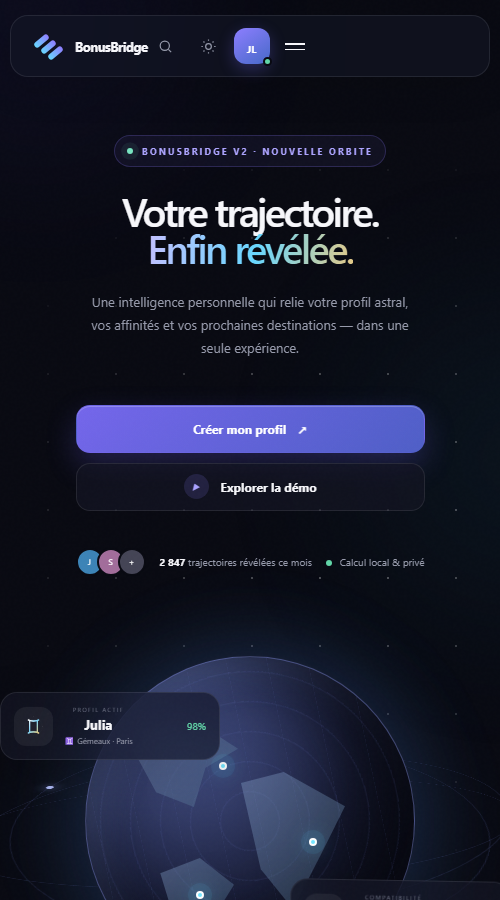

# BonusBridge V2 — Orbital Intelligence

BonusBridge V2 est une expérience SaaS statique premium qui relie profils astraux, affinités personnelles et mobilité internationale. L'application fonctionne entièrement dans le navigateur, sans framework, sans npm et sans transmission obligatoire de données.

[Accéder à BonusBridge](https://otherlight77.github.io/BonusBridge/)

## Aperçu

### Desktop



### Responsive



## Fonctionnalités

- interface premium responsive avec thèmes sombre et clair, glassmorphism et micro-interactions ;
- profils préconfigurés Julia (Gémeaux) et Sacha (Balance) ;
- configurateur progressif : identité, naissance, pays, ville, signe, ascendant et préférences ;
- calcul local du signe solaire et estimation d'ascendant ;
- roue astrologique SVG interactive avec zoom, rotation et effets lumineux ;
- carte de neuf destinations avec scoring, filtres et comparaison multiple ;
- tableau de bord : accueil, profils, comparateur, historique, favoris, paramètres et admin ;
- recherche instantanée accessible avec `Ctrl+K` ou `Cmd+K` ;
- sauvegarde locale, import JSON, export Excel et impression PDF ;
- PWA installable, cache hors ligne et état réseau ;
- notifications navigateur optionnelles ;
- architecture IA découplée avec scoring local et client API désactivé par défaut ;
- SEO complet : Schema.org, OpenGraph, Twitter Cards, sitemap et robots.

> L'ascendant affiché est une estimation d'interface. L'architecture permet de brancher ultérieurement une API d'éphémérides pour un calcul astronomique certifié.

## Utilisation locale

Aucune dépendance n'est nécessaire. Avec Node.js :

```powershell
node scripts/serve.mjs
```

Ouvrez ensuite <http://127.0.0.1:4173/>. Un serveur HTTP est recommandé pour tester les modules JavaScript et le service worker ; ouvrir directement `index.html` ne permet pas toutes les fonctions PWA.

## Déploiement GitHub Pages

Le workflow officiel `.github/workflows/deploy-pages.yml` publie la racine du dépôt à chaque push sur `main` et peut être lancé manuellement avec `workflow_dispatch`. Il ne nécessite ni build, ni npm, ni framework.

URL publique : <https://otherlight77.github.io/BonusBridge/>

## Architecture

```text
BonusBridge/
├── .github/workflows/deploy-pages.yml  # Déploiement Pages (inchangé)
├── ai/                                 # API, scoring et recommandations
├── assets/                             # Identité, icônes SVG et carte sociale
├── components/                         # Contrats des composants DOM
├── css/                                # Tokens, styles applicatifs, responsive
├── data/                               # Profils et destinations structurés
├── icons/                              # Compatibilité de l'arborescence initiale
├── images/screenshots/                 # Captures validées
├── js/                                 # Application, calcul, stockage et PWA
├── scripts/serve.mjs                   # Serveur local sans dépendance
├── index.html                          # Coque sémantique de la SPA
├── manifest.webmanifest                # Métadonnées PWA
├── sw.js                               # Cache et fonctionnement hors ligne
├── robots.txt                          # Directives d'indexation
└── sitemap.xml                         # URL canonique
```

## Données et confidentialité

Les profils créés sont enregistrés dans `localStorage`. L'import et les exports restent locaux. Le client IA est désactivé et aucune clé ni donnée personnelle n'est envoyée. Toute activation future d'une API devra passer par un backend, un consentement explicite et une politique de conservation.

## Accessibilité et performance

- structure sémantique, lien d'évitement, libellés ARIA et focus visibles ;
- navigation clavier du configurateur, de la recherche, de la FAQ et du tableau de bord ;
- contraste conçu pour viser WCAG AA ;
- prise en charge de `prefers-reduced-motion` et réglage manuel ;
- SVG légers, absence de police ou bibliothèque externe, chargement modulaire ;
- révélations via `IntersectionObserver` et cache applicatif versionné.

Audit Lighthouse local du 21 juillet 2026 :

| Profil | Performance | Accessibilité | Bonnes pratiques | SEO |
|---|---:|---:|---:|---:|
| Desktop | 100 | 100 | 100 | 100 |
| Mobile | 99 | 100 | 100 | 100 |

## Roadmap

- [x] Expérience V2 responsive et profils Julia/Sacha
- [x] Configurateur, roue interactive, carte et tableau de bord
- [x] PWA, import/export, recherche, favoris et admin local
- [ ] API d'éphémérides haute précision
- [ ] Authentification chiffrée et synchronisation multi-appareils
- [ ] Moteur IA serveur avec consentement et explicabilité
- [ ] Analytics réels respectueux de la vie privée
- [ ] Internationalisation français/anglais

## Licence

Projet BonusBridge. Tous droits réservés.
